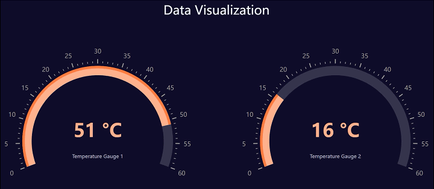

# Data Set in GridDB realizes data visualization on WEB

This project was built with ECharts, SpringBoot, WebSocket & GridDB. 

....Uploading...

## Technology Stack
Operating system: Ubuntu-18.04.6\
Front-end: HTML, JavaScript, ECharts 5.4.0, WebSocket\
Back-end: Java 11.0.2, Spring Boot, WebSocket, Maven\
development tool: IntelliJ IDEA 2019\
Database: GridDB 5.1.0
